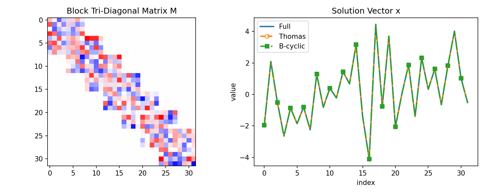
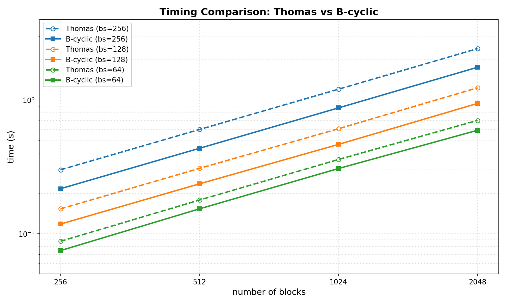

# blocktrix

A JAX library for efficiently solving block tri-diagonal matrix systems

Author: [Philip Mocz (@pmocz)](https://github.com/pmocz/)

⚠️ **Warning: Work in Progress**

This library is still under active development and is not guaranteed to work at this point XXX.


## Installation

```bash
pip install blocktrix
```

## Usage


```python
import jax
from blocktrix import solve_block_tridiagonal_bcyclic, random_block_tridiagonal

# Generate a random test system
key = jax.random.PRNGKey(42)
n_blocks, block_size = 8, 4

lower, diag, upper, rhs = random_block_tridiagonal(key, n_blocks, block_size)

# Solve the system
x = solve_block_tridiagonal_bcyclic(n_blocks, lower, diag, upper, rhs)
```




## It's fast!




## Links

* [Code repository](https://github.com/pmocz/blocktrix)
* [Documentation](https://github.com/pmocz/blocktrix)


## Cite this repository

If you use this software, please cite it as below.

XXX
