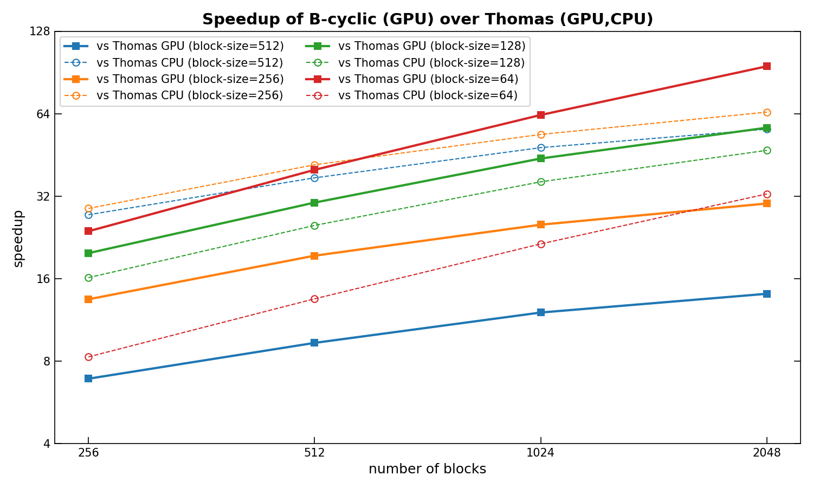

# Timing

Timing test of blocktrix library

Philip Mocz (2026)

## Usage

```console
python timing.py
python plot.py
```

## Timing

<div style="display:flex;flex-wrap:wrap;gap:8px">
  
</div>

## Speedup

<div style="display:flex;flex-wrap:wrap;gap:8px">
  
</div>